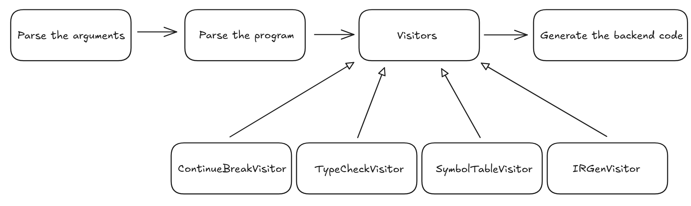

# Documentation du Compilateur IFCC

## Vue d'ensemble

Le compilateur IFCC est un compilateur pour un sous-ensemble du langage C, développé comme projet pédagogique. Il utilise une approche basée sur la génération de code intermédiaire (IR) puis la traduction en code assembleur x86 et WebAssembly (WAT).

## Flux d'exécution

Le compilateur suit les étapes suivantes :

1. Parse des arguments de la ligne de commande
2. Tokenisation et analyse syntaxique du programme d'entrée
3. Vérification des instructions `break` et `continue` avec ContinueBreakVisitor
4. Construction de la table des symboles avec SymbolTableVisitor
5. Vérification des types avec TypeCheckVisitor
6. Génération de la représentation intermédiaire avec IRGenVisitor
7. Génération du code cible (x86_64 ou WebAssembly)



## Architecture du Compilateur

L'architecture du compilateur est structurée selon les phases classiques de compilation:

1. **Analyse lexicale et syntaxique** : Utilisation d'ANTLR4 pour générer un parseur à partir de la grammaire définie dans `ifcc.g4`.
2. **Analyse sémantique** : Plusieurs visiteurs parcourent l'AST pour effectuer des vérifications et construire des tables.
3. **Génération de code intermédiaire** : Transformation de l'AST en représentation intermédiaire.
4. **Génération de code cible** : Traduction de la représentation intermédiaire en assembleur x86 et WebAssembly.

## Grammaire Supportée

La grammaire définie dans `ifcc.g4` supporte:

- Déclarations et définitions de fonctions
- Variables et types de base (int, char, double)
- Expressions arithmétiques et logiques
- Structures de contrôle (if-else, while)
- Instructions de saut (break, continue)
- Pointeurs basiques
- Tableaux à une dimension

## Visiteurs et Analyses

### ContinueBreakCheckVisitor
- Validation de l'utilisation des instructions `break` et `continue` dans des contextes appropriés
- Vérifie que ces instructions sont uniquement utilisées à l'intérieur des boucles
- Signale une erreur si elles sont trouvées en dehors de leur contexte valide

### SymbolTableGenVisitor
- Construction de la table des symboles
- Enregistrement des variables avec leur type, offset et portée
- Enregistrement des fonctions avec leur type et paramètres
- Vérification des déclarations/utilisations
- Calcul des adresses des variables en mémoire
- Gestion des règles de portée (scoping)
- Vérification de la validité des appels de fonction et de la correspondance des arguments

### TypeCheckVisitor
- Vérification de la cohérence des types dans les expressions
- Validation des types de retour des fonctions
- Vérification de compatibilité lors des affectations
- Signalement d'erreurs si les types sont incompatibles
- Génération d'avertissements si une conversion implicite est effectuée

### IRGenVisitor
- Génération de la représentation intermédiaire
- Traitement des expressions et conversion en instructions IR
- Gestion des structures de contrôle (if, while)
- Construction des blocs de base et du CFG (Control Flow Graph)
- Génération d'un code IR indépendant de l'architecture cible

## Représentation Intermédiaire

### Structure de la RI
- **CFG (Control Flow Graph)** : Représentation du flux de contrôle d'une fonction
- **BasicBlock** : Bloc d'instructions sans branchement (sauf à la fin)
- **IRInstr** : Instructions de la représentation intermédiaire

### Types d'Instructions IR
- Instructions arithmétiques : `Add`, `Sub`, `Mul`, `Div`, `Mod`, `UnaryMinus`
- Instructions logiques : `And`, `Or`, `Not`
- Instructions de comparaison : `CompareInt`
- Instructions de manipulation mémoire : `Rmem`, `Wmem`
- Instructions de contrôle : `Prologue`, `Epilogue`, `Call`
- Instructions de chargement : `LdConstInt`, `Copy`

## Génération de Code

### Code x86-64
- Génération d'instructions assembleur x86-64 pour Linux
- Gestion de la pile et des registres
- Utilisation des conventions d'appel System V AMD64 ABI

### Code WebAssembly
- Génération de fichiers WAT (WebAssembly Text Format)
- Support des opérations arithmétiques et logiques
- Gestion des variables locales et mémoire
- Implémentation des contrôles de flux équivalents à ceux de x86

## Types Supportés

- `int` (INT32_T, INT64_T)
- `char` (INT8_T)
- `double` (FLOAT64_T)
- Pointeurs (PTR_INT32_T, PTR_FLOAT64_T)

## Fonctionnalités Avancées

- **Optimisation constante** : Évaluation des expressions constantes à la compilation
- **Gestion des registres virtuels** : Abstraction des registres physiques
- **Multi-cibles** : Génération de code pour différentes architectures (x86, WebAssembly)
- **Vérification des erreurs** : Détection d'erreurs sémantiques et rapport
- **Incréments/décréments** : Support des opérateurs `++` et `--` (préfixés et postfixés)
- **Opérateurs d'affectation composés** : Support de `+=`, `-=`, `*=`, `/=`, `%=`

## Limitations Connues

- Pas de support pour les structures et unions
- Pas de support pour les énumérations
- Support limité des pointeurs
- Pas d'optimisation avancée
- Tableaux à une seule dimension uniquement

## Options de Ligne de Commande

Le compilateur accepte les options suivantes :
- `-o <output_file>` : Spécifie le nom du fichier de sortie
- `-v` : Active le mode verbeux, qui affiche la table des symboles dans la sortie
- `-h` : Affiche le message d'aide
- `-wat` : Génère du code WebAssembly au lieu de x86_64
- `<source_file.c>` : Le fichier source C d'entrée à compiler

## Comment Compiler et Exécuter

Pour compiler le projet:
```bash
cd compiler
make
```

Pour exécuter le compilateur sur un fichier source:
```bash
./ifcc input.c -o output.s
```

Pour générer du WebAssembly:
```bash
./ifcc input.c -wat -o output.wat
```

## Tests

Des tests unitaires et d'intégration sont disponibles dans le répertoire `../tests/testfiles/`. Pour exécuter les tests:

```bash
cd compiler
make test
```

Cette commande lance le script Python `../ifcc-test.py` qui exécute tous les tests dans le répertoire `../tests/testfiles/`. Le script vérifie la sortie du compilateur par rapport aux résultats attendus. 

Pour lancer les tests en WebAssembly:
```bash
make test-wat 
```

Cette commande lance le script Python `../ifcc-wat-test.py` qui exécute les tests dans le répertoire `../tests/testfiles/`. Notez que tous les tests ne passent pas en WebAssembly car c'est une version béta qui ne prend pas en charge toutes les fonctionnalités de la version x86. 